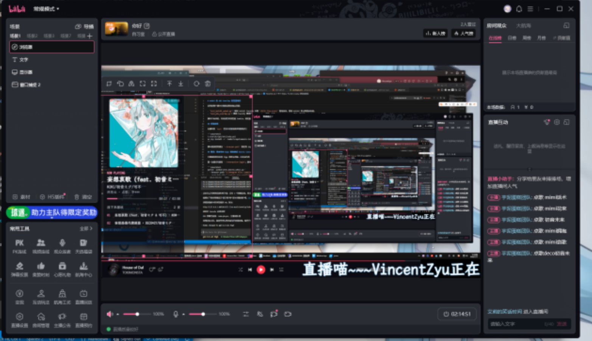
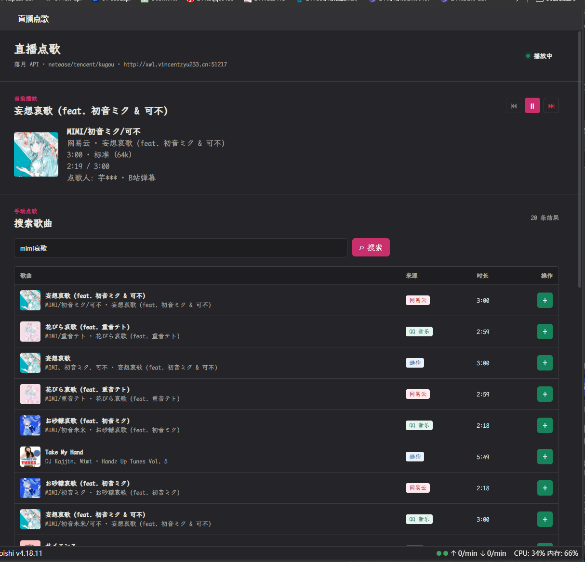

> 💡 推荐前往 [GitHub](https://github.com/VincentZyuApps/koishi-plugin-bili-live-music) 阅读 README，体验更好。

# 🎵 koishi-plugin-bili-live-music

[](https://www.npmjs.com/package/koishi-plugin-bili-live-music)
[](https://npm-stat.com/charts.html?package=koishi-plugin-bili-live-music)
[](https://github.com/VincentZyuApps/koishi-plugin-bili-live-music)
[](https://qm.qq.com/q/ZHj33L5cuC)

<h2>💬 交流反馈</h2>
<p>🐛 Bug 反馈 / 💡 建议 / 👨‍💻 插件交流，欢迎加群：<b>1085190201</b> 🎉</p>
<p>💡 在群里直接艾特 @VincentZyu，回复更及时~ ✨</p>

🎵 B 站直播间点歌，支持弹幕、Bot 与 WebUI 队列管理 🎛️，可通过 OBS 浏览器源或插件专属 VLC 进程播放音频 ✨

---

## ⚡ 快速开始

1. **📦 第一步：安装插件**
   - 在 Koishi 插件市场中搜索并安装 `bili-live-music`；
   - 确保启用 `w-node` 依赖服务；若需使用 WebUI 队列管理面板，请同时启用 `console`。

2. **🏠 第二步：配置填入 `roomId`**
   - 在插件配置的「B 站监听配置」中填入直播间号 `roomId`（直播间网页链接末尾的纯数字）；
   - 普通公开直播间先留空 `cookie` 和 `uid` 即可，插件会自动分配匿名设备标识进行免登录监听。

3. **📺 第三步：配置 OBS Overlay 或 对接 VLC**
   - **Browser 模式（推荐）**：保持默认 `browser` 后端，在 OBS 中新建「浏览器」源，URL 填写插件生成的 Overlay 地址（默认 `http://127.0.0.1:60716/bili-live-music/overlay?token=test12345&mode=player&layout=standard`），建议勾选“通过 OBS 控制音频”；
   - **VLC 模式**：播放后端选择 `vlc` 并配置 `vlcExecutablePath`（如 `vlc` 或 VLC 完整安装路径），插件将启动专属后台进程直接从本地声卡输出音频。

4. **🎉 第四步：B 站开播进行测试~**
   - 开启直播姬正常开播；
   - 在自己的直播间发送一条测试弹幕：`点歌 晴天`；
   - 稍候片刻即可在 OBS 画面与控制台中看到歌曲自动入队并开始播放！✨

---

## 📸 效果预览

### OBS / B 站直播姬播放器与弹幕点歌效果


### Koishi 控制台 WebUI 点歌台管理面板


---

## 🚀 功能特性

- 📡 **B 站直播间弹幕监听**：识别 `点歌 歌名`，内置 6 节点指数退避重连状态机，支持匿名免登录监听。
- 🎵 **多音乐源与双后端**：支持网易云直链与落月 API（网易云、QQ 音乐、酷狗），支持多源并行搜索与交替合并。
- 📋 **健全的点歌限制**：提供单用户冷却（CD）、单用户排队上限、队列总上限以及单曲最大时长保护。
- 🔊 **Browser / VLC 双播放后端**：OBS 网页播放适合直接混音；VLC 专属隐藏进程由插件统一调度，提供稳定本地推流声卡输出。
- 🖥️ **独立 Fastify 播放服务**：OBS Overlay 与 WebSocket 独立监听，提供迷你（mini）、标准（standard）、侧栏（sidebar）三种精美紧凑画布。
- 🧭 **Koishi 控制台深度集成**：包含「直播点歌」管理控制台与「弹幕状态机」可视化流转面板。

---

## 💬 指令区域

插件提供观众点歌、Bot 消息点歌以及完整的管理员控制台指令。

### 1. 点歌指令

| 指令 / 触发方式 | 可用场景 | 说明与示例 |
|---|---|---|
| `点歌 <歌名>` | B 站直播间弹幕 | 直播间观众发送弹幕点歌，例如：`点歌 晴天`。受冷却时间与队列限制约束。 |
| `bili-live-music.request <歌名>` | QQ / 平台消息 | 在群聊或私聊中向 Bot 发送点歌请求，例如：`bili-live-music.request 晴天`。可在配置项中指定群聊或私聊可用。 |

### 2. 管理员指令

> ⚠️ 以下控制指令默认需要 **3 级管理员权限**。

| 指令 | 权限 | 说明 |
|---|---|---|
| `bili-live-music.status` | 3 级 | 查看当前正在播放的歌曲信息、播放进度及等待队列中的歌曲列表。 |
| `bili-live-music.skip` | 3 级 | 手动跳过当前正在播放的歌曲，立即推进播放队列下一首。 |
| `bili-live-music.clear` | 3 级 | 一键清空所有等待中的点歌队列，正在播放的曲目不受影响。 |
| `bili-live-music.overlay` | 3 级 | 获取携带访问令牌（Token）的 OBS 浏览器源地址。默认仅在 Koishi 后台控制台输出以保密 Token。 |
| `bili-live-music.danmu.status` | 3 级 | 查询当前 B 站直播间弹幕连接状态、当前 generation 标识与网络心跳。 |
| `bili-live-music.danmu.reconnect` | 3 级 | 主动断开当前弹幕连接并立即触发重新认证与连接，最多等待 10 秒并返回结果。 |

---

## 🖥️ WebUI 管理区域

插件在 Koishi 控制台中注册了专属管理页面，并向 OBS 浏览器源提供独立 Overlay 视图：

### 1. 点歌扩展控制台
- **播放状态监控**：实时显示当前播放歌曲的封面、歌名、歌手、点歌人、点歌来源、实时进度条与播放状态（加载中/播放中/暂停/已结束/失败）。
- **实时队列管理**：支持置顶、上移、下移、单曲移除或一键清空等待队列；WebUI 手动点歌会绕过用户 CD 与单人上限。
- **多平台聚合搜索**：在控制台中直接搜索歌曲，多平台并行查询并交替合并，点击即可直接将歌曲加入播放队列。
- **运行时音量与控制**：提供 0–100% 实时音量滑块（运行时调整不影响原配置文件）；提供上一首、播放/暂停、切歌控制按钮。
- **后端守护与排错**：在 VLC 模式下提供「检测 VLC 路径」、「查询系统音频输出设备 ID」以及「手动重启 VLC 进程」操作。

### 2. 状态机扩展控制台
- **6 节点可视化状态机**：展示 `disabled`（已禁用）、`starting`（启动中）、`connected`（已连接）、`waiting`（等待重试）、`reconnecting`（重连中）、`stopped`（已停止）六种生命周期状态图。
- **指数退避机制**：连接失败自动按 `1s -> 2s -> 4s -> 8s -> 16s -> 32s` 进行指数退避重试，达到 32 秒上限后无限持续重试。开播前先启动 Koishi 也能在开播后自动连上，无需重启插件。
- **内存事件轨迹**：面板实时记录最近 25 条状态转移历史（包含时间戳、状态变动、触发事件与连接耗时）。
- **Generation 隔离**：重连时自动递增 generation 标识，确保网络抖动时旧连接的迟到回调不会污染新连接状态。

### 3. 用于 OBS 的 Layer 页面
- **独立 Fastify 服务**：OBS 页面与 WebSocket 独立运行在专有端口（默认 `60716`），不受 Koishi 控制台重启影响，内置端口租约避免 HMR 冲突。
- **角色分离机制**：
  - `mode=player`（主播放器）：负责真实解码播放音频，向服务端报告播放进度、自然结束与加载失败；适合 OBS 浏览器源使用。
  - `mode=display`（只读展示端）：只同步渲染歌曲封面、文字与队列进度，静音运行；适合第 2 个 OBS 场景或副屏监看。
- **三种紧凑固定画布尺寸**（画布透明且自适应居中）：
  - `mini`（`520 × 104`）：极简布局，显示封面、歌名、歌手与小进度条，适合置于直播画面角落。
  - `standard`（`640 × 240`）：标准布局，显示当前播放详情、点歌人、大进度条与后续 2 首排队曲目。
  - `sidebar`（`300 × 667`）：纵向侧栏布局，显示大封面、完整歌曲信息与后续 5 首排队曲目。
- **交互控制与历史回退**：悬停时显示上一首、暂停和切歌按钮；末尾歌曲播放结束后保留封面并显示半透明遮罩（“已播放结束”/“已跳过”/“播放失败”）。
- **开源字体服务**：前后端共享 Fastify 字体路由，自动下载并校验霞鹜文楷（`LXGWWenKaiMono-Regular.ttf`）。

---

## 🔧 配置项

### 📡 1. B 站监听配置

| 配置项 | 类型 | 默认值 | 说明 |
|---|---|---|---|
| `enabled` | `boolean` | `true` | 是否启动 B 站直播间弹幕监听 |
| `roomId` | `string` | `""` | B 站直播间号（直播间 URL 末尾的数字，如 `1854258163`） |
| `cookie` | `string` | `""` | B 站 Cookie（普通公开直播间留空即可，会自动生成匿名标识） |
| `uid` | `string` | `""` | B 站登录账号 UID（仅在填写 Cookie 时生效，个人主页末尾数字） |
| `listenerVersion` | `string` | `"0.5.4"` | 通过 w-node 加载的 blive-message-listener 版本 |

> 📌 **B 站登录与 Cookie 说明**：
> - 监听普通公开直播间**完全不需要登录**。Cookie 留空时，插件会自动初始化匿名 `buvid3` 设备标识并使用 `uid=0`。
> - 只有在受限直播间、需要显示弹幕发送者完整用户名，或 B 站限制匿名访问时，才需填写登录 Cookie。登录 Cookie 建议包含 `SESSDATA`、`DedeUserID` 与 `buvid3`，且配置中的 `uid` 必须与 `DedeUserID` 一致。

---

### 🎵 2. 点歌入口与音乐后端

| 配置项 | 类型 | 默认值 | 说明 |
|---|---|---|---|
| `commandPrefix` | `string` | `"点歌"` | B 站直播间弹幕点歌的前缀关键词 |
| `botRequestContexts` | `string[]` | `["group"]` | Bot 点歌指令 `bili-live-music.request` 的生效场景（`group` 群聊 / `private` 私聊） |
| `musicBackend` | `"netease" \| "luoyue"` | `"netease"` | 统一音乐后端，同时作用于 B 站弹幕、Bot 指令与 WebUI |
| `searchLimit` | `number` | `3` | 弹幕与 Bot 自动点歌时的单平台搜索候选数量 |
| `webuiSearchLimit` | `number` | `20` | WebUI 搜索面板返回的候选歌曲目标总数 |
| `neteaseDirectApi` | `string` | `"api.qijieya.cn"` | 网易云直链后端节点（可选 `api.injahow.cn` / `api.qijieya.cn` / `meting.jmstrand.cn` / `metingapi.nanorocky.top`） |
| `apiBaseUrl` | `string` | `"https://api.vkeys.cn"` | 落月 API 基础 URL，支持官方或自建镜像 |
| `enabledSources` | `string[]` | `["netease", "tencent"]` | 启用的音乐平台（`netease` 网易云 / `tencent` QQ 音乐 / `kugou` 酷狗） |
| `neteaseQuality` | `number` | `1` | 网易云音乐最大音质参数 |
| `tencentQuality` | `number` | `10` | QQ 音乐最大音质参数 |
| `kugouQuality` | `string` | `"320"` | 酷狗音乐最大音质参数 |

> 🌙 **落月 API 支持矩阵与自建说明**：
> 
> `apiBaseUrl` 默认使用落月官方 API：
> ```text
> https://api.vkeys.cn
> ```
> 也可在 Koishi 控制台中替换为 VincentZyu 自建 API：
> ```text
> http://xwl.vincentzyu233.cn:51217
> ```
> 
> | API 地址 | 网易云 | QQ 音乐 | 酷狗 |
> |---|---|---|---|
> | `https://api.vkeys.cn` (官方) | 支持 | 支持 | 当前不支持 |
> | `http://xwl.vincentzyu233.cn:51217` (自建) | 支持 | 支持 | 支持 |
> 
> 自建 API 如果不可用，可在 QQ 群 `1085190201` 联系 `@VincentZyu`。
> 
> ⚠️ **混合内容警告**：自建 API 当前使用 HTTP。如果 Koishi 控制台通过 HTTPS 对外提供服务，浏览器可能会拦截 API 返回的 HTTP 音频直链。建议使用本地 HTTP OBS 浏览器源，或为 API 部署 HTTPS 反向代理。

> 🌐 **音乐后端与多平台聚合机制**：
> - `netease`：直接调用网易云直链节点生成播放 URL。
> - `luoyue`：多选平台后，WebUI 搜索将并行请求所有已启用的平台并交替合并结果。搜索阶段只获取元数据，加入队列时才动态解析播放直链。

---

### 📋 3. 队列与点歌限制

| 配置项 | 类型 | 默认值 | 说明 |
|---|---|---|---|
| `maxQueueSize` | `number` | `30` | 播放队列的最大长度限制 |
| `perUserLimit` | `number` | `3` | 单个用户允许同时排队的最大歌曲数 |
| `cooldown` | `number` | `25` | 单用户点歌冷却时间，单位**秒**（设为 0 关闭 CD） |
| `maxDuration` | `number` | `600000` (10分钟) | 允许点歌的单曲最大时长，单位毫秒 |
| `historyLimit` | `number` | `25` | 内存中保留的最近播放历史记录数，用于“上一首”重播 |

> ⏳ **冷却与限制机制说明**：
> - `cooldown` 以秒为单位。B 站弹幕与 Bot 点歌均受此限制。
> - 在 B 站匿名监听（`uid=0`）时，插件会自动按弹幕发送者的用户名分别计时，避免所有观众共享同一个冷却 CD。
> - WebUI 管理员手动加歌会绕过用户 CD 与单人配额，但仍受单曲时长与队列总上限约束。

---

### ▶️ 4. 播放后端配置

| 配置项 | 类型 | 默认值 | 说明 |
|---|---|---|---|
| `playbackBackend` | `"browser" \| "vlc"` | `"browser"` | 音频播放后端：`browser` 为网页播放器，`vlc` 为插件专属 VLC 隐藏进程 |
| `playbackVolume` | `number` | `100` | 初始播放音量（0–100%），控制台运行时调整不会写回配置文件 |
| `playbackLoadTimeout` | `number` | `25` | 单曲加载超时阈值（秒），超时后标记为“播放失败”并自动播放下一首 |
| `vlcExecutablePath` | `string` | `"vlc"` | VLC 可执行文件路径（系统 PATH 中已有则填 `vlc`，否则填绝对路径） |
| `vlcRcPort` | `number` | `60717` | VLC RC 控制端口，固定监听 `127.0.0.1` |
| `vlcStartupTimeout` | `number` | `10000` | VLC 进程启动与 RC 建立连接的超时时间（毫秒） |
| `vlcAudioDevice` | `string` | `""` | VLC 音频设备内部 ID（留空使用系统默认设备，可在 WebUI 查询设备列表） |
| `vlcShowWindow` | `boolean` | `false` | 是否显示 VLC 窗口（默认隐藏，排错时可开启） |
| `vlcAutoRestart` | `boolean` | `true` | VLC 进程异常退出时是否自动拉起重启 |
| `vlcRestartLimit` | `number` | `1` | 自动重启最大重试次数，超限后保留当前歌曲与队列并暂停调度 |

> 🔊 **播放后端与 VLC 说明**：
> - **Browser 模式**：通过 OBS 浏览器源的 `<audio>` 播放，声音直接进入 OBS 混音器。
> - **VLC 模式**：适用于将音频直接由设备独立声卡播放输出。正式支持 Windows x64 VLC `3.0.18–3.0.23`。
> - 歌曲地址失效或解码失败时会自动跳过。若 VLC 进程整体崩溃，会自动重启并重播当前歌曲；重启失败则保留队列等待管理员在 WebUI 修复并重启。

---

### 🖥️ 5. OBS 独立播放服务

| 配置项 | 类型 | 默认值 | 说明 |
|---|---|---|---|
| `obsServerHost` | `string` | `"0.0.0.0"` | Fastify 独立 HTTP 服务监听地址（`0.0.0.0` 监听所有网卡） |
| `obsServerPort` | `number` | `60716` | Fastify 独立端口（被占用时启动失败并提示） |
| `obsPublicHost` | `string` | `"127.0.0.1"` | 生成并展示给 OBS 使用的访问地址或域名 |
| `obsAccessToken` | `string` | `"test12345"` | Overlay 页面与 WebSocket 访问密钥，**正式使用务必修改** |
| `overlayPath` | `string` | `"/bili-live-music/overlay"` | OBS 浏览器源页面访问路径 |
| `wsPath` | `string` | `"/bili-live-music/ws"` | OBS 浏览器源 WebSocket 路径 |
| `overlayTemplatePath`| `string` | 默认模板路径 | OBS 页面模板路径，运行时保存在 `ctx.baseDir/data/assets` |
| `fontPath` | `string` | 默认字体路径 | 霞鹜文楷字体文件路径 |
| `overlayCommandConsoleOnly` | `boolean` | `true` | 指令查询 OBS 地址时是否仅向控制台输出完整令牌地址 |

> 🔤 **霞鹜文楷字体获取机制**：
> - 插件启动时会自动将 `LXGWWenKaiMono-Regular.ttf` 下载到 `data/assets/bili-live-music/fonts`。
> - 优先从 Gitee release 下载，失败后自动 fallback 至 GitHub release，并严格校验 SHA-256。
> - Fastify 服务内置字体路由，页面断网或在 HTTPS 下被阻断时会自动降级为系统字体。

---

### 🧭 6. 控制台与 WebUI 设置

| 配置项 | 类型 | 默认值 | 说明 |
|---|---|---|---|
| `enableMusicManagementPage` | `boolean` | `true` | 是否启用「直播点歌」管理控制台页面正文 |
| `enableDanmuStateMachinePage` | `boolean` | `false` | 是否启用「弹幕状态机」可视化页面正文 |
| `webuiSearchExpireMinutes` | `number` | `30` | WebUI 搜索缓存有效期（分钟，小于等于 0 永不过期） |

> 💡 **页面路由与搜索缓存说明**：
> - 关闭页面内容开关后，Console 路由仍会保留，方便随时开启而无需重启 Koishi。
> - `webuiSearchExpireMinutes`：搜索候选结果在内存中保留的分钟数，过期后点击加歌会提示重新搜索；插件重启或 HMR 热重载会清空搜索缓存。

---

### 🐛 7. 调试设置

| 配置项 | 类型 | 默认值 | 说明 |
|---|---|---|---|
| `verboseConsoleLog` | `boolean` | `false` | 是否在控制台打印详细调试日志 |

> 🔍 **关于 verboseConsoleLog**：
> - 开启后，控制台会详细输出 WebUI 搜索标识、候选歌曲 ID、API 请求参数、响应状态与各阶段耗时。
> - 为保护接口安全，带有时效签名的完整音频播放直链**绝对不会**输出到日志中。
